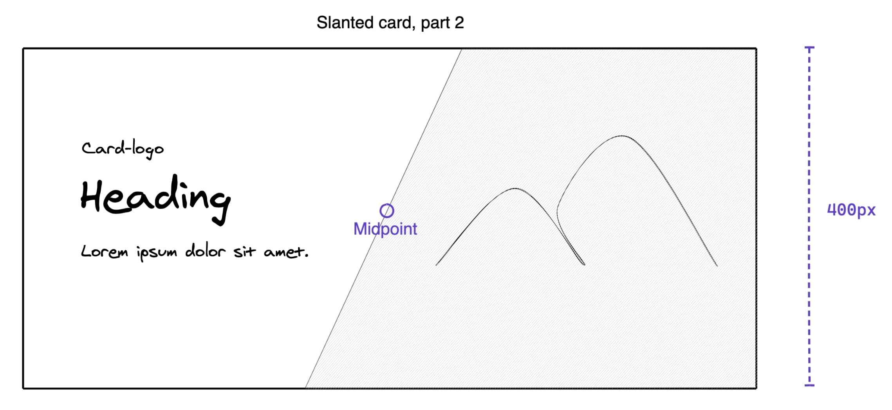

# Rebuild exercises

## Title: Slanted card

### Rules

- You may not make changes to "index.html"
- You may only make changes to "css/style.css"

### Exercise description

In this exercise your job is to create a slanted edge slicing through a card component containing some text content and an image. The angle of the slanted edge must be consistent at all screen sizes and its midpoint must intersect with that of the diagonals of the card (see video reference).

Reference:

### In two parts

You may want to split up the exercise into two parts.

#### Part 1

Create a two-column grid of equal width; one containing the text content and the other containing an image. The image must maintain its aspect ratio while filling the element’s entire content box; it will be clipped to fit. The card component must never be taller than 400px.

---

#### Part 2

Continue to work on introducing a slanted edge slicing through the card. The angle of the slanted edge must be consistent at all screen sizes and its midpoint must intersect with that of the diagonals of the card (see video reference above).

_Resources:_ [clip-path maker](https://bennettfeely.com/clippy/)

