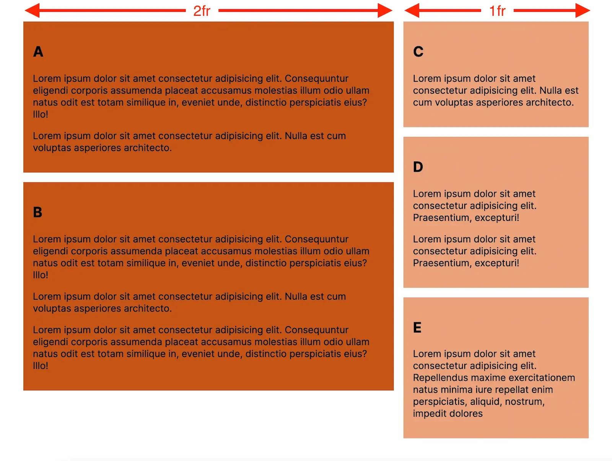
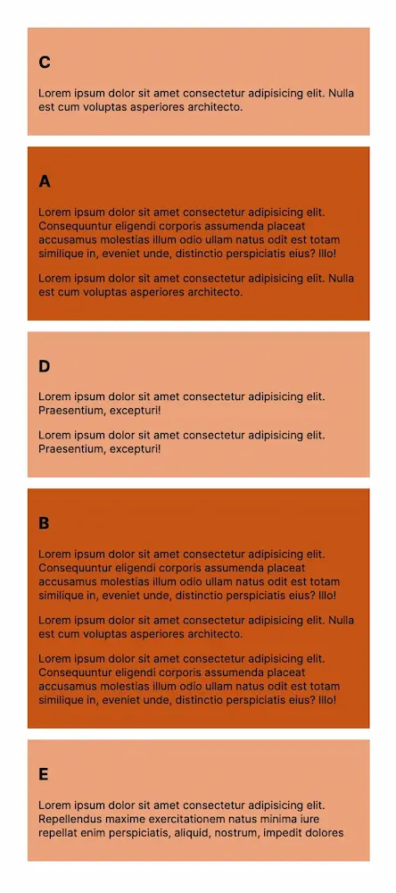

# Rebuild exercises

## Title: Impossible Layout

### Rules

- You may make changes to "index.html"
- You may make changes to "css/style.css"

### Exercise description

In this exercise your job is to create a responsive layout, which goes from a two-column layout to a single-column layout controlled by a single media query rule. The `article`s with the classes of `.a` and `.b` are in the left column, and `.c`, `.d`, and `.e` are in the right column on larger screen sizes. The order of the `article` elements changes once the viewport is smaller than `40rem` (see video reference).

<table>
    <thead>
        <tr>
            <th colspan="2"><code>> 40rem</code></th>
        </tr>
    </thead>
    <tbody>
        <tr>
            <td>a</td>
            <td>c</td>
        </tr>
        <tr>
            <td>b</td>
            <td>d</td>
        </tr>
        <tr>
            <td></td>
            <td>e</td>
        </tr>
    </tbody>
</table>

<table>
    <thead>
        <tr>
            <th><code>< 40rem</code></th>
        </tr>
    </thead>
    <tbody>
        <tr>
            <td>c</td>
        </tr>
        <tr>
            <td>a</td>
        </tr>
        <tr>
            <td>d</td>
        </tr>
        <tr>
            <td>b</td>
        </tr>
        <tr>
            <td>e</td>
        </tr>
    </tbody>
</table>

**NB:** Note that each `article` should be allowed to have a flexible height which is dependent on its content.

References:

Video

<video controls src="nest-is-coming.mp4"></video>

---

Desktop

---

Mobile
