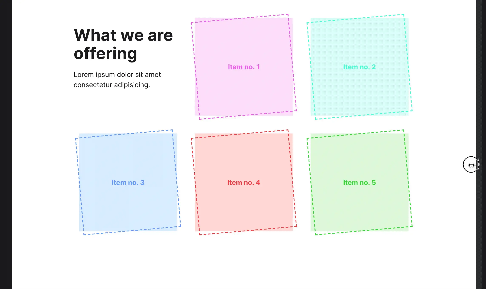
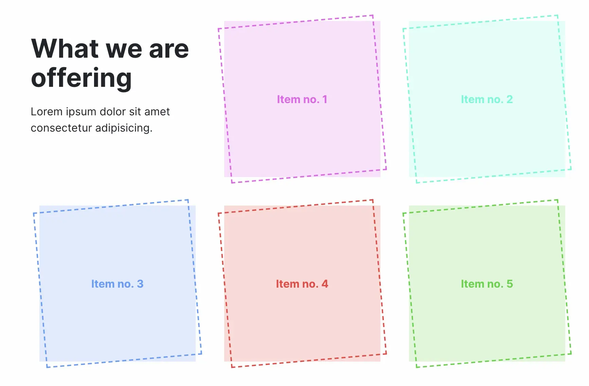

# Rebuild exercises

## Title: Equal-sized Boxes

### Rules

- 🚫 You may _NOT_ make changes to "index.html"
- ✅ You may only make changes to "css/style.css"

### Exercise description

In this exercise your job is to create a simple 3x2 grid layout containing a header element (`h2`, `p`) and five colored boxes in an unordered list, which all have a tilted (`-5deg`) dashed border (see video reference). The colors to be used are referenced on each list item as a custom property. The content width is `800px`.

**You may not make changes to the HTML document**.

References:

Video

---

Image
