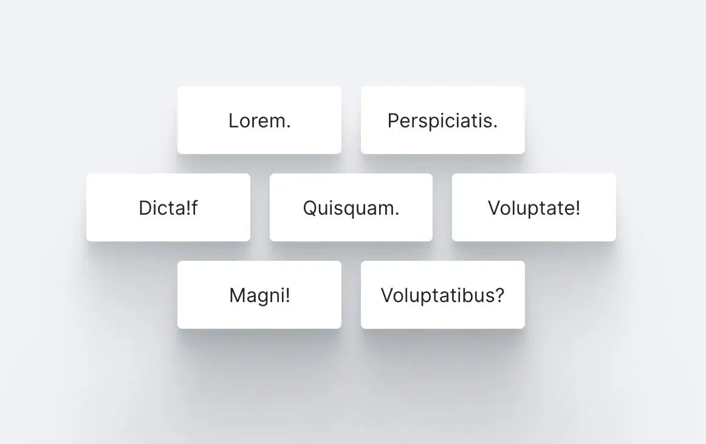
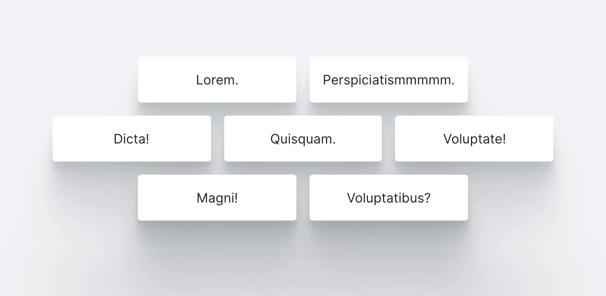

# Rebuild exercises

## Title: Equal-sized Boxes

### Rules

- 🚫 You may _NOT_ make changes to "index.html"
- ✅ You may only make changes to "css/style.css"

### Exercise description

In this exercise your job is to create a flexible layout of seven boxes, which are of equal sizes regardless of the width of the content inside each box. The boxes are laid out next to each other over three rows; the top and bottom rows in pairs of two towards the center, and the middle row accomodate three of the seven boxes (see video reference).

References:

Video

---

Normal

---

Expanded
